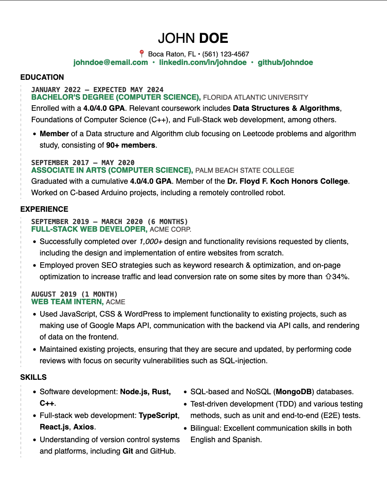

## Resume template

A fully customizable resume template for Computer Science students, written in HTML & CSS.

In classic Computer Science student fashion, build the resume yourself by using code, instead of using a resume builder or Word. 😎

## Customizing

All customization can be done on the `resume.html` file, by changing the inline CSS styling.

## Saving as PDF

* Open the `resume.html` file on your browser.
* Press `CTRL + P` or find your browser's Print dialog.
* Remove margins, URL, headers and footers from the Print dialog.
* Scale it appropriately (usually `90%` works).
* Ensure it is a single page.
* Save as PDF.

## Preview

